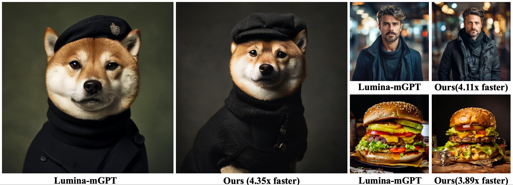

# [ICCV 2025] Grouped Speculative Decoding for Autoregressive Image Generation

> **Official PyTorch implementation for the ICCV 2025 paper "Grouped Speculative Decoding for Autoregressive Image Generation (GSD)"**

---

## Roadmap

- [x] Release Arxiv Paper
- [x] Release Initial Codebase
- [ ] Release Colab tutorial
- [ ] Apply to more AR models (e.g., Lumina mGPT 2)

---

## Usage

### 1. Download Tokenizer

Our model uses the image tokenizer from Meta's Chameleon. Please download the necessary files from [Meta's Chameleon homepage](https://ai.meta.com/resources/models-and-libraries/chameleon-downloads/).

Place the downloaded files into the `ckpts/chameleon/tokenizer/` directory. The final folder structure should look like this:

    ckpts/
    └── chameleon/
        └── tokenizer/
            ├── checklist.chk
            ├── text_tokenizer.json
            ├── vqgan.ckpt
            └── vqgan.yaml

### 2. Install Dependencies

We recommend using **PyTorch >= 2.3.0**. Install the required packages with pip:

    pip install transformers==4.48.1 sentencepiece accelerate>=0.26.0 absl-py

### 3. Run Tests

#### Test our GSD model

To generate images with our **GSD** model, run the following command. You can change the prompt directly within the `test_GSD.py` file.

    python test_GSD.py

#### Test the baseline (SJD)

To compare the speed with the **SJD (ICLR 2025) baseline**, run this command:

    python test_SJD.py

---

## Acknowledgements

This implementation is heavily based on the official repository for SJD by tyshiwo1: [tyshiwo1/Accelerating-T2I-AR-with-SJD](https://github.com/tyshiwo1/Accelerating-T2I-AR-with-SJD).
